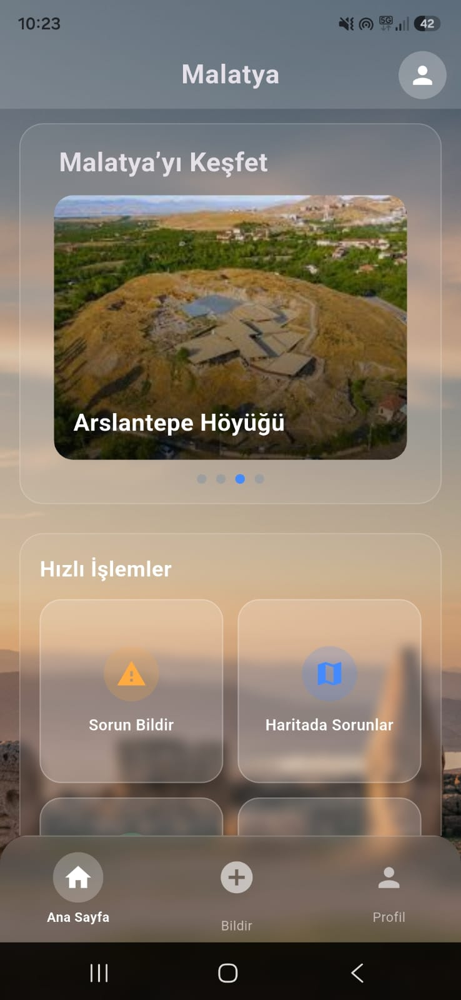
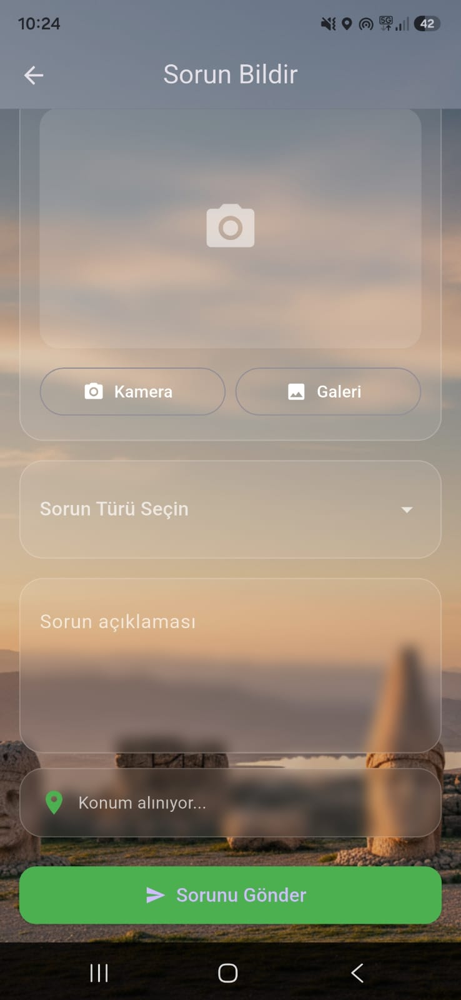
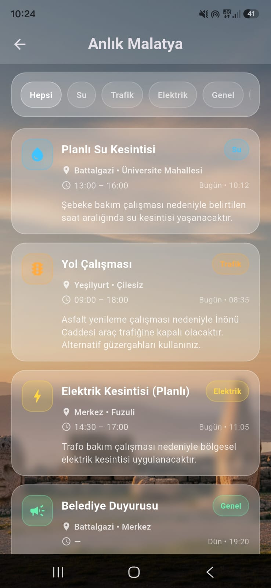
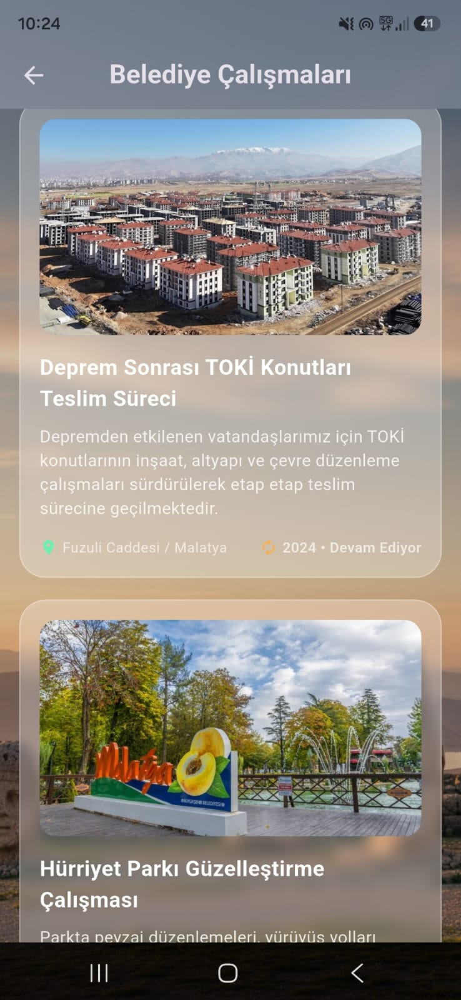
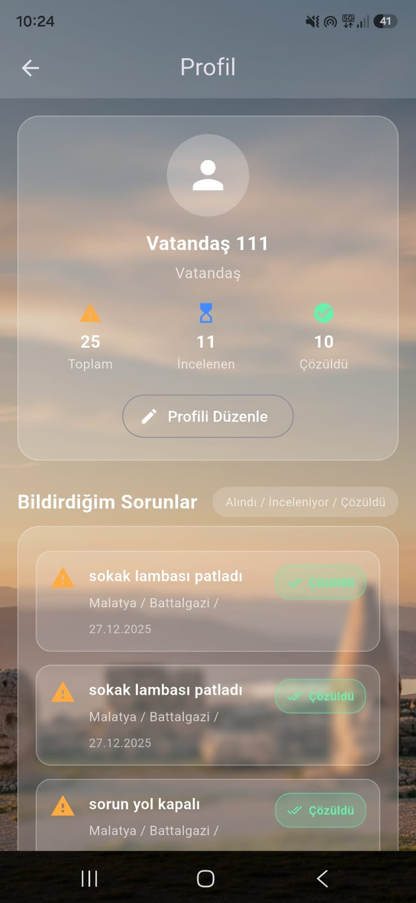

# 📱 Uygulama Ekran Görüntüleri

| Ana Sayfa | Sorun Bildir |
|-----------|--------------|
|  |  |

| Anlık Malatya | Belediye Çalışmaları |
|---------------|----------------------|
|  |  |

| Profil |
|---------|
|  |

# 🏛️ Malatya Belediye Sorun Bildirim Sistemi

Vatandaşların belediye hizmetlerine daha hızlı, kolay ve etkili şekilde erişebilmesi amacıyla geliştirilen Flutter tabanlı mobil uygulamadır.

Uygulama sayesinde vatandaşlar şehirde karşılaştıkları sorunları fotoğraf ve konum bilgisi ile belediyeye iletebilir, bildirimlerinin durumunu takip edebilir, belediye çalışmalarını inceleyebilir ve Malatya hakkında güncel bilgilere ulaşabilir.

---
# 📖 Proje Hakkında

Malatya Belediye Sorun Bildirim Sistemi, vatandaş ile belediye arasındaki iletişimi dijital ortama taşıyan akıllı şehir uygulamasıdır.

Vatandaşlar şehir içerisinde karşılaştıkları;

- Yol bozuklukları
- Sokak lambası arızaları
- Çöp sorunları
- Altyapı problemleri
- Park ve çevre düzeni sorunları
- Trafik ile ilgili problemler

gibi birçok sorunu uygulama üzerinden fotoğraf, açıklama ve konum bilgisi ile belediyeye iletebilir.

Ayrıca uygulama sadece sorun bildirimi yapmakla kalmaz; belediye çalışmaları, güncel duyurular ve Malatya'nın kültürel alanları hakkında da kullanıcıları bilgilendirir.

---

# 🎯 Projenin Amacı

Bu projenin temel amacı;

- Vatandaşların belediyeye ulaşmasını kolaylaştırmak
- Sorun bildirim süreçlerini dijital ortama taşımak
- Bildirimlerin daha hızlı değerlendirilmesini sağlamak
- Belediye çalışmalarını şeffaf şekilde vatandaşlara sunmak
- Malatya'nın tanıtımına katkı sağlamak
- Akıllı şehir uygulamalarına örnek bir mobil sistem geliştirmektir.

---

# ✨ Uygulama Özellikleri

## 👤 Kullanıcı İşlemleri

- Kullanıcı kayıt sistemi
- Giriş yapma
- Profil görüntüleme
- Profil düzenleme
- Bildirim geçmişi

---

## 🚨 Sorun Bildirimi

- Fotoğraf çekme
- Galeriden fotoğraf seçme
- Otomatik GPS konumu alma
- Sorun kategorisi seçme
- Sorun açıklaması yazma
- Belediye sistemine gönderme

---

## 📊 Bildirim Takibi

- Toplam bildirim sayısı
- İncelenen bildirimler
- Çözülen bildirimler
- Bildirim geçmişi

---

## 📰 Anlık Malatya

Vatandaşları güncel gelişmeler hakkında bilgilendirir.

İçerikler:

- Planlı su kesintileri
- Elektrik kesintileri
- Trafik çalışmaları
- Belediye duyuruları
- Kategori filtreleme

---

## 🚧 Belediye Çalışmaları

Belediyenin devam eden projeleri vatandaşlarla paylaşılır.

Örneğin;

- TOKİ Konutları
- Yol çalışmaları
- Park düzenlemeleri
- Altyapı çalışmaları
- Çevre düzenleme projeleri

---

## 🏛️ Malatya'yı Keşfet

Şehrin kültürel ve turistik alanlarını tanıtır.

Örnek içerikler:

- Arslantepe Höyüğü
- Tarihi yapılar
- Parklar
- Müzeler
- Turistik alanlar

---

## 🗺️ Harita Modülü

- Harita üzerinden sorunları görüntüleme
- Konum tabanlı erişim
- Bölgesel inceleme

---

# 🛠️ Kullanılan Teknolojiler

- Flutter
- Dart
- Firebase Authentication
- Cloud Firestore
- Google Maps
- Geolocator
- Image Picker
- Material Design

```

# 🎯 Proje Kazanımları

Bu proje sayesinde;

- Mobil uygulama geliştirme
- Firebase kullanımı
- Harita servisleri
- Konum servisleri
- Fotoğraf işleme
- UI/UX tasarımı
- CRUD işlemleri
- Gerçek zamanlı veri yönetimi

konularında deneyim kazanılmıştır.

---

# 👨‍💻 Geliştirici

**Gönül Doğru**

Bilgisayar Mühendisliği Öğrencisi

Bu proje akademik çalışma kapsamında geliştirilmiştir.
