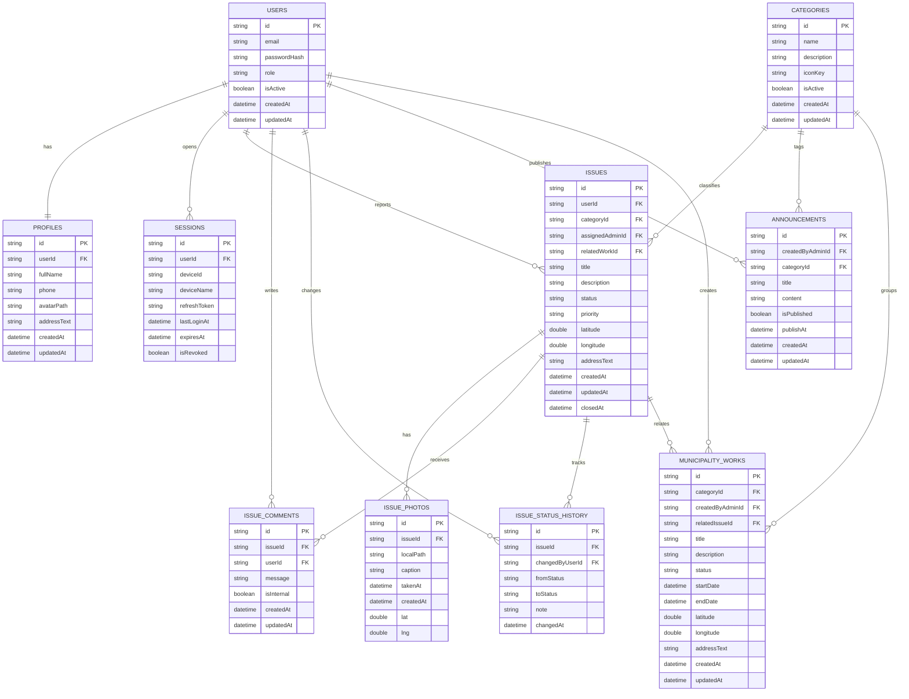

# City Issue Tracker — ER Diyagramı (Hive Box Tasarımı)

Bu doküman Hive box (tablo) tasarımını ve ilişkileri göstermektedir.
İlişkiler id (FK) üzerinden kuruludur (issue.userId, issue.categoryId vb.).

## Tablolar / Box'lar (10 adet)

- users
- sessions
- profiles
- issues
- issue_photos
- issue_status_history
- issue_comments
- categories
- municipality_works
- announcements

## Mermaid ER Diyagramı

